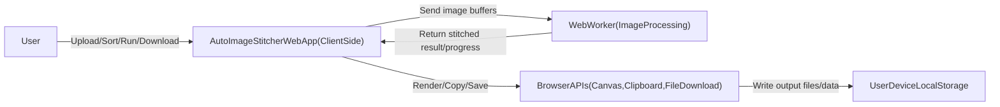

# Conceptualization Document
**프로젝트명:** 스크롤 캡처 자동 병합 웹 서비스 (Auto Image Stitcher)

## 1. Business Purpose

### 1.1 Project Background
스마트폰이나 PC를 사용하다 보면 긴 웹페이지, 메신저 대화, 문서 등을 캡처해야 할 때가 많습니다. 하지만 화면에 한 번에 담기지 않아 여러 장으로 나누어 캡처한 뒤, 이를 다시 하나의 이미지로 자연스럽게 이어 붙이는 작업은 매우 번거롭고 시간이 오래 걸립니다.

이러한 불편함을 해소하기 위해, 사용자가 순서대로(혹은 순서와 무관하게) 여러 장의 캡처 이미지를 업로드하면 시스템이 겹치는 영역을 자동으로 인식하여 한 장의 깔끔한 긴 이미지로 병합해 주는 웹 서비스를 기획했습니다.

### 1.2 Goal
- 여러 장의 캡처 이미지 간의 중복 영역을 자동으로 탐지하고 병합(Stitching)하는 웹 서비스 개발
- 병합된 이미지를 고화질의 `JPG` 또는 `PNG` 포맷으로 다운로드하는 기능 제공
- 개인정보 유출 우려를 줄이기 위해 서버 전송 없이 브라우저(Client-side) 내에서 병합 처리 지원

### 1.3 Target Market
- 긴 대화 내용이나 자료를 캡처하여 공유하려는 일반 스마트폰/PC 사용자
- 업무상 여러 장의 화면 캡처를 하나의 문서로 취합해야 하는 직장인 및 학생

## 2. System Context Diagram

## 3. Use Case List

| Actor | Use Case | Description |
| :--- | :--- | :--- |
| User | 이미지 업로드 | 병합할 여러 장의 캡처 이미지를 웹에 업로드한다. |
| User | 순서 정렬 및 편집 | 업로드된 이미지의 순서를 드래그 앤 드롭으로 변경하거나 불필요한 이미지를 삭제한다. |
| User | 자동 병합 요청 | 이미지 병합을 요청하여 결과를 미리보기 화면으로 확인한다. |
| User | 결과물 다운로드 | 성공적으로 병합된 이미지를 `JPG` 또는 `PNG` 파일로 로컬 기기에 저장한다. |
| User | 클립보드 복사 | 병합 결과를 클립보드로 복사하여 다른 앱에 즉시 붙여넣는다. |

## 4. Concept of Operation

### 4.1 이미지 입력 및 자동 정렬 (Input and Auto Reorder)
| 항목 | 설명 |
| :--- | :--- |
| Purpose | 사용자가 순서에 구애받지 않고 편리하게 이미지를 시스템에 제공함 |
| Approach | 이미지 간 상하단 겹침 픽셀 유사도를 계산하여 올바른 스크롤 순서를 자동 탐색 및 재배열 |
| Dynamics | 스크롤 캡처 후 갤러리에서 여러 장을 한 번에 선택해 업로드하는 경우 |
| Goals | 파일명/업로드 순서에 의존하지 않는 스마트한 정렬 제공 |

### 4.2 고정 UI 인식 및 이미지 병합 (Stitching with Fixed UI Removal)
| 항목 | 설명 |
| :--- | :--- |
| Purpose | 화면 상하단의 고정 UI를 제거하고 자연스럽게 이어 붙임 |
| Approach | 픽셀 변화가 적은 상단/하단 고정 영역을 크롭한 뒤, 본문 영역 중심 특징 매칭으로 합성 |
| Dynamics | 배터리 상태바, 앱 하단 메뉴바 등이 반복 포함되는 캡처를 병합하는 경우 |
| Goals | 어긋남이나 중복 요소(헤더 반복 등) 없이 하나의 자연스러운 결과 이미지 생성 |

### 4.3 결과 출력 및 내보내기 (Export and View)
| 항목 | 설명 |
| :--- | :--- |
| Purpose | 처리된 결과물을 원하는 포맷으로 즉시 활용 가능하게 지원 |
| Approach | 결과 미리보기(축소/확대 토글), `클립보드 복사`, `JPG 저장`, `PNG 저장` 제공 |
| Dynamics | 완성된 이미지를 메신저에 붙여넣거나 파일로 소장하려는 경우 |
| Goals | 저장/공유 과정의 번거로움을 최소화하여 UX 향상 |

## 5. Problem Statement

### 5.1 과도한 중복 또는 부족한 겹침 영역
사용자가 스크롤을 너무 많이 내려 겹침이 없거나 너무 조금 내려 중복이 과도한 경우, 알고리즘이 연결 지점을 찾지 못할 수 있다.

**해결 방안**
- 특징점/템플릿 매칭 실패 시 단순 상하 연결 폴백(Fallback) 모드 제공
- 사용자 피드백 메시지 제공: "이미지 간 겹치는 영역이 부족합니다."

### 5.2 다양한 기기와 해상도 파편화
스마트폰 화면 비율과 캡처 해상도가 달라 고정 UI 높이, 스크롤 바 형태가 기기마다 다를 수 있다.

**해결 방안**
- 절대 픽셀 좌표가 아닌 이미지 간 유사도 기반의 동적 크롭 판단
- 템플릿 매칭(다중 스케일 포함) 기반으로 기기 차이에 유연하게 대응

### 5.3 클라이언트 사이드 성능 한계
수십 장의 고해상도 이미지를 브라우저에서 직접 병합할 경우 메모리 초과나 UI 멈춤이 발생할 수 있다.

**해결 방안**
- Web Worker로 병합 연산을 백그라운드 스레드로 분리
- 진행률(Progress) 표시로 처리 상태를 명확히 안내

## 6. Glossary

| Term | Description |
| :--- | :--- |
| Image Stitching (이미지 병합) | 여러 장의 사진에서 겹치는 부분을 찾아 하나의 매끄러운 이미지로 연결하는 기술 |
| Fixed UI (고정 UI) | 스크롤을 내려도 화면 상단/하단에 고정되어 움직이지 않는 요소 |
| Template Matching | 특정 패턴이나 이미지 조각이 원본의 어느 위치와 가장 일치하는지 찾는 기법 |
| Web Worker | 브라우저 메인 스레드와 분리되어 무거운 연산을 처리하는 백그라운드 실행 기술 |

## 7. References

- OpenCV.js Template Matching Documentation: [https://docs.opencv.org/3.4/d8/dd1/tutorial_js_template_matching.html](https://docs.opencv.org/3.4/d8/dd1/tutorial_js_template_matching.html)
- MDN Web Docs - Clipboard API: [https://developer.mozilla.org/en-US/docs/Web/API/Clipboard_API](https://developer.mozilla.org/en-US/docs/Web/API/Clipboard_API)
